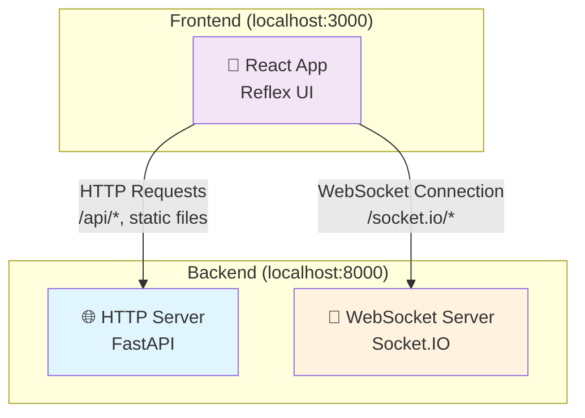

# 📦 Proyecto FastAPI + Reflex + PostgreSQL

Este proyecto está construido con:

- ✅ **[FastAPI](https://fastapi.tiangolo.com/)** como backend (API REST)
- ✅ **[Reflex](https://reflex.dev/docs/getting-started/introduction/)** como interfaz de usuario (frontend)
- ✅ **[PostgreSQL](https://www.postgresql.org/docs/)**  como base de datos relacional

## 📁 Estructura general del proyecto

> [!NOTE]
> Sección en construcción - susceptible a cambios futuros.

```
agendaReflex/
│
├── .venv/                                         # Entorno virtual generado por UV (Autoaislamiento de dependencias)
│
├── .web/                                          # Carpeta interna usada por Reflex para construir y servir el frontend (Next.js build)  
│
├── src/                                           # Código fuente principal del proyecto
│   │
│   ├── __init__.py                                # Hace que `src/` sea un paquete importable                   
│   │
│   ├── backend/                                   # Toda la lógica del servidor FastAPI
│   │   │ 
│   │   ├── api/                                   # Endpoints de la API y sus dependencias
│   │   │   │
│   │   │   ├── routes/                            # Rutas organizadas por dominio o funcionalidad
│   │   │   │   ├── users.py                       # Rutas públicas relacionadas con usuarios
│   │   │   │   ├── users_admin.py                 # Rutas exclusivas para gestión admin de usuarios
│   │   │   │   ├── events.py                      # Rutas públicas relacionadas con eventos
│   │   │   │   ├── events_admin.py                # Rutas exclusivas para gestión admin de eventos
│   │   │   │   └── auth.py                        # Rutas de login, logout, registro, etc.
│   │   │   │
│   │   │   └── dependencies/                      # Dependencias compartidas entre endpoints
│   │   │       ├── auth_guard.py                  # Autenticación con OAuth2 u otros sistemas
│   │   │       └── auth_cookies.py                # Middleware de autenticación vía cookies seguras
│   │   │
│   │   ├── db/                                    # Conexión y gestión de la base de datos
│   │   │   └── db_handler.py                      # Inicialización, conexión y helpers para SQL
│   │   │
│   │   ├── models/                                # Modelos de datos y validación con SQLModel (ORM + Pydantic)
│   │   │   │
│   │   │   ├── user/                              # Modelos y DTOs relacionados con usuarios
│   │   │   │   ├── model.py                       # Modelo para el uso con ORM de usuario
│   │   │   │   └── DTOs/                          # Data Transfer Objects de usuarios
│   │   │   │       ├── base.py                    # Base común
│   │   │   │       ├── create.py                  # DTO para crear usuario
│   │   │   │       ├── update.py                  # DTO para modificar usuario
│   │   │   │       ├── read.py                    # DTO para devolver usuario al cliente
│   │   │   │       ├── token.py                   # DTO para manejar los JWT (Tokens) relacionados con el usuario
│   │   │   │       └── login.py                   # DTO para login de usuario
│   │   │   │
│   │   │   └── event/                             # Modelos y DTOs relacionados con eventos
│   │   │       ├── model.py                       # Modelo para el uso con ORM de evento
│   │   │       └── DTOs/                          # Data Transfer Objects de eventos
│   │   │           ├── base.py                    # Base común
│   │   │           ├── create.py                  # DTO para crear evento
│   │   │           ├── update.py                  # DTO para modificar evento
│   │   │           └── read.py                    # DTO para devolver evento al cliente
│   │   │
│   │   ├── services/                              # Lógica de negocio desacoplada de la API
│   │   │   ├── user_service.py                    # Operaciones y reglas sobre usuarios
│   │   │   └── event_service.py                   # Operaciones y reglas sobre eventos
│   │   │
│   │   ├── utils/                                 # Funciones auxiliares del backend
│   │   │   ├── jwt.py                             # Generación y verificación de JWT
│   │   │   ├── cors.py                            # Middleware de configuración CORS
│   │   │   └── hashing.py                         # Hasheo y verificación de contraseñas
│   │   │
│   │   ├── __init__.py                            # Permite tratar la carpeta src/backend como un paquete Python
│   │   ├── config.py                              # Carga y gestión de configuración (env, rutas, etc.)
│   │   └── main.py                                # Punto de entrada de la aplicación FastAPI
│   │
│   └── frontend/                                  # Interfaz de usuario construida con Reflex
│       ├── assets/                                # Archivos estáticos que se servirán en público (logos, fuentes, imágenes)
│       ├── components/                            # Componentes reutilizables de interfaz (inputs, botones, tarjetas...)
│       ├── pages/                                 # Páginas de navegación (index, login, dashboard...) mapeadas como rutas
│       ├── services/                              # Funciones que consumen el backend desde el frontend (vía httpx)
│       ├── state/                                 # Estados reactivos de Reflex (State classes que definen la lógica UI)
│       ├── styles/                                # Temas, colores, breakpoints, estilos globales CSS-in-Python
│       ├── utils/                                 # Funciones visuales: validaciones, formatos, etc.
│       │
│       ├── __init__.py                            # Permite tratar la carpeta frontend como un paquete Python
│       └── main.py                                # Punto de entrada de Reflex (crea la app, importa páginas y monta FastAPI como backend)
│
├── .env                                           # Variables de entorno sensibles (JWT, DB, etc.)
├── uv.lock                                        # Archivo de bloqueo de dependencias de UV
├── pyproject.toml                                 # Archivo de configuración raíz: dependencias, scripts, metadata del proyecto
└── rxconfig.py                                    # Configuración específica de Reflex (WebSocket CORS, app name, frontend settings)
```

---

## ⚙️ Gestión del entorno con UV

Este proyecto utiliza **[UV](https://github.com/astral-sh/uv)** para la gestión de dependencias, entornos virtuales y ejecución de scripts.

### 🔍 ¿Qué es UV?

**UV** es un gestor de proyectos y paquetes Python ultrarrápido, escrito en Rust, que reemplaza herramientas como `pip`, `pipx`, `poetry`, `virtualenv` y más. Permite:

- **Gestión de entornos virtuales**: Crea y maneja entornos sin configuración manual.
- **Instalación de dependencias**: Instala paquetes de forma eficiente y reproducible.
- **Ejecución de scripts**: Corre scripts con dependencias aisladas y versiones específicas de Python.
- **Mantener un archivo de bloqueo (`uv.lock`)**: que garantiza que las instalaciones sean idénticas en cualquier equipo.

### 🚀 Instalación de Uv

Si aún no tienes UV instalado:

```bash
py -m pip install uv
```

### 📦 Configuración inicial del proyecto

1. **Clona el repositorio** y navega al directorio:
```bash
git clone <tu-repositorio>
cd agendaReflex
```

2. **Inicializa el proyecto**:
```bash
py -m uv init
```

Este comando inicializa el proyecto para usar uv:
- Crea un entorno virtual aislado para el proyecto `.venv/`.
- Genera los archivos de configuración inicial (`pyproject.toml`, `uv.lock` si no existen).
- Prepara el proyecto para gestionar dependencias y scripts desde uv.

3. **Instala todas las dependencias**:
```bash
py -m uv sync
```

Este comando sincroniza el entorno con las dependencias definidas en tu `pyproject.toml`:
- Instala o actualiza todos los paquetes listados en el archivo.
- Garantiza que el entorno virtual está alineado con las versiones bloqueadas en `uv.lock`.
- Si no existe `uv.lock`, lo crea para asegurar reproducibilidad futura.
- Si hay cambios en `pyproject.toml` (nuevas dependencias, versiones), actualiza el entorno para reflejarlos.

## 🌐 Arquitectura de Servidores: CORS y Comunicación

### 🏗️ ¿Por qué Reflex necesita configuración CORS independiente?

Una de las particularidades más importantes de este proyecto es entender por qué necesitamos configurar CORS en **dos lugares distintos**: FastAPI y Reflex.

### 📡 Arquitectura de Dual Servidor

Cuando ejecutas la aplicación, **NO se levanta un solo servidor**. Reflex crea internamente **DOS servidores independientes**:



### 🔧 Configuración CORS Dual

**1. CORS en FastAPI (`src/backend/utils/cors.py`):**
```python
from fastapi.middleware.cors import CORSMiddleware

app.add_middleware(
    CORSMiddleware,
    allow_origins=["http://localhost:3000"],  # ← Solo para HTTP requests desde el frontend
    allow_credentials=True,
    allow_methods=["*"],
    allow_headers=["*"],
)
```

**2. CORS en Reflex (`rxconfig.py`):**
```python
config = rx.Config(
    cors_allowed_origins=[
        "http://localhost:8000",  # Backend
        "http://localhost:3000"   # Frontend ← CRÍTICO para WebSockets
    ],
)
```

### 🎯 ¿Qué maneja cada servidor?

| Servidor | Protocolo | Responsabilidad | CORS Config |
|----------|-----------|-----------------|-------------|
| **HTTP Server** | HTTP/HTTPS | • Endpoints REST (`/api/*`)<br/>• Archivos estáticos<br/>• Páginas HTML | FastAPI `CORSMiddleware` |
| **WebSocket Server** | WebSocket | • Estado reactivo en tiempo real<br/>• Sincronización de componentes<br/>• Socket.IO connections | Reflex `cors_allowed_origins` |

### ⚠️ ¿Qué pasa si solo configuramos uno?

**Solo FastAPI CORS configurado:**
```bash
✅ HTTP requests funcionan (/api/users, /api/events)
❌ WebSocket falla → No hay actualizaciones reactivas en tiempo real
```

**Solo Reflex CORS configurado:**
```bash
❌ HTTP requests fallan → No se pueden hacer llamadas a la API
✅ WebSocket funciona → Estado reactivo funciona
```

### 🔍 Flujo completo de una request

```python
# 1. Frontend carga la página
Frontend → GET /                            → HTTP Server (FastAPI CORS) ✅

# 2. Frontend hace llamada a API  
Frontend → POST /api/users                  → HTTP Server (FastAPI CORS) ✅

# 3. Reflex establece conexión WebSocket
Frontend → WebSocket /socket.io/            → WebSocket Server (Reflex CORS) ✅

# 4. Estado reactivo se sincroniza
Component State Change → WebSocket          → Frontend Update ✅
```

## 🚀 Ejecutar la aplicación

### 🎯 Comando principal (Recomendado)

Desde la **raíz del proyecto** (`agendaReflex/`), para levantar **toda la aplicación** (Backend (FastAPI + WebSocket) + Frontend):

```bash
py -m uv run reflex run
```

Este comando:
1. **Inicia el servidor HTTP** (FastAPI) en `http://localhost:8000`
2. **Inicia el servidor WebSocket** (Socket.IO) internamente
3. **Compila y sirve el frontend** en `http://localhost:3000`
4. **Configura hot-reload** para desarrollo

## ✅ Buenas prácticas internas

> [!NOTE]
> Sección en construcción - susceptible a cambios futuros.

- Las rutas **solo deben recibir y responder** datos, sin lógica pesada.  
- Toda la lógica de negocio debe estar en los servicios.  
- Las consultas SQL deben estar separadas en archivos específicos.  
- Las rutas privadas deben usar `Depends(get_current_user)` de el auth_guard para protección.  
- No conectar directamente a la base de datos desde los endpoints.  
- No incluir lógica de negocio dentro de las rutas.  

## 📚 Recursos para aprender Reflex

### 🔗 Tutorial completo de Reflex por *MoureDev*

📺 [Repositorio del tutorial](https://github.com/mouredev/python-web/)

```text
Este tutorial en vídeo cubre paso a paso distintos aspectos del desarrollo de aplicaciones web utilizando Reflex.

✅ Ventajas:
- Explicaciones claras y progresivas.
- Ejemplos prácticos de uso real de Reflex.

⚠️ Consideraciones:
- Utiliza Docker para el entorno de desarrollo.
- El despliegue se realiza en Vercel, por lo que tendremos que adaptar los pasos a otro entorno local o de producción.
```

---

Si tienes dudas, grita, no importa.  
Este README es nuestra brújula. 🧭


